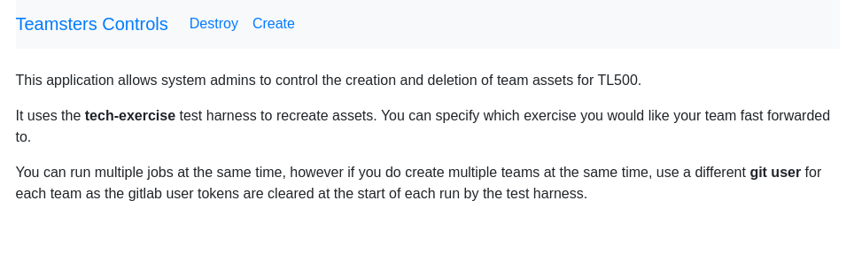
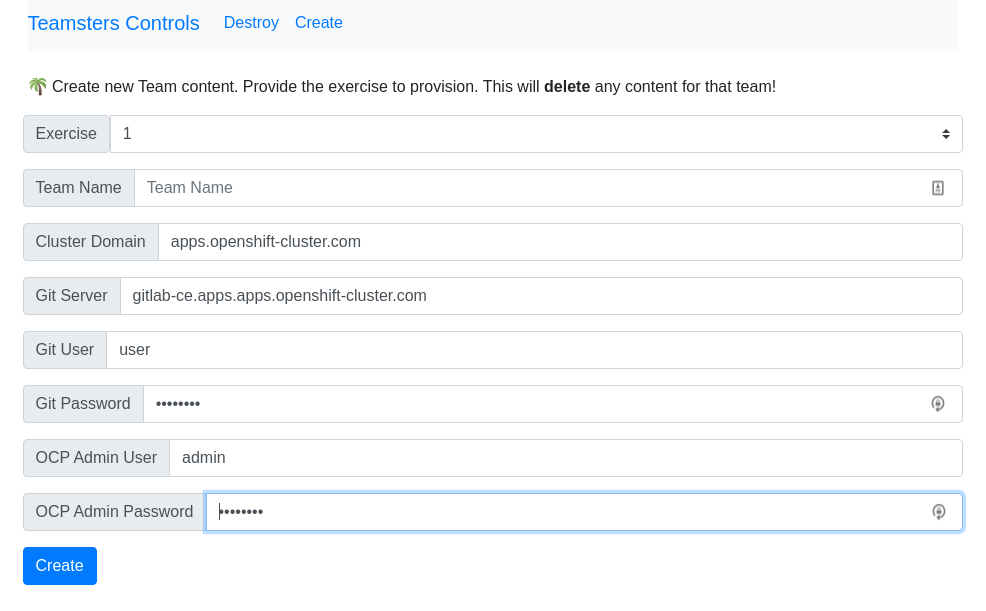

# tl500-teamsters






## Configuration

```bash
# set the following env vars
export CLUSTER_DOMAIN=         # cluster base domain (no https://)
export GIT_SERVER=             # git server (no https://)
export TEAM_NAME=              # team name [a-bA-B0-9-]
export GITLAB_USER=            # team gitlab username (same as ocp username)
export GITLAB_PASSWORD=        # team gitlab password for user
export OCP_ADMIN_USER=         # an ocp cluster-admin user
export OCP_PASSWORD=           # an ocp cluster-admin password
```

## Run

```bash
mvn quarkus:dev
```
